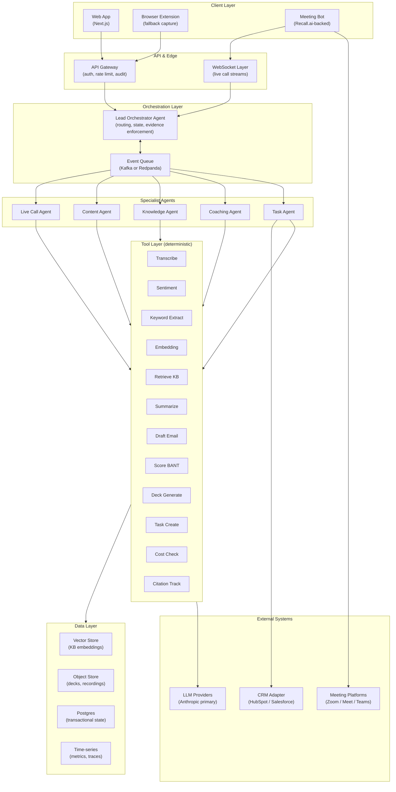

# Architecture: AI-Native Discovery Call Platform
**Companion to:** `01_PRD.md`
**Version:** 0.1 (Draft)
**Owner:** Ahmad
**Last updated:** May 2026

---

## 1. Architectural Position

Before diving into the diagram, three positions that shape every decision downstream:

### Position 1: Fewer agents, more tools

The transcript implied 10+ agents (sentiment, task, completeness, creative, content generation, knowledge base, etc). We reject that shape.

**Why:** Agent proliferation is the leading failure mode in production agentic systems. Each additional agent multiplies handoff failures, debugging surface area, latency, and cost. Most "agents" people imagine are actually **tools** — deterministic functions an LLM calls — not autonomous reasoning loops.

**Our shape:** One orchestrator + five specialist agents + ~15 tools. Anything that doesn't require multi-step reasoning is a tool, not an agent.

### Position 2: Evidence before answers

Every agent output is structured as `{answer, citations[], confidence}`. The platform never renders an answer without a citation trail. This is enforced at the orchestration layer, not by hoping prompts behave.

### Position 3: Live and async are different systems

The live-call hot path has different requirements from async work (briefs, summaries, content generation). We isolate them. Live runs on streaming infra, low-latency models, aggressive caching. Async runs on batch infra, higher-quality models, more deliberate reasoning.

---

## 2. System Diagram

---

## 3. The Five Agents (and why only five)

| Agent | Owns | Triggered by | Sample tools used |
|---|---|---|---|
| **Live Call Agent** | Everything that happens during an in-progress call | Live transcript stream | Sentiment, Keyword Extract, Retrieve KB, Citation Track |
| **Content Agent** | Generating new assets (decks, slides, one-pagers) and finding existing ones | Content gap signals, AE requests | Retrieve KB, Embedding, Deck Generate |
| **Knowledge Agent** | Maintaining the KB: ingestion, tagging, deprecation, effectiveness scoring | Schedule + user actions | Embedding, Retrieve KB |
| **Coaching Agent** | Producing coaching insights, scorecards, win-loss analysis | Post-call + weekly schedule | Summarize, Score BANT, Retrieve KB |
| **Task Agent** | Creating tasks, drafting emails, executing CRM writes | Post-call + AE approvals | Draft Email, Task Create, CRM Adapter |

Everything else (sentiment analysis, summarization, scoring, etc) is a **tool**, not an agent. Tools are deterministic, callable, cacheable, individually testable, and cheap.

---

## 4. The Lead Orchestrator

The orchestrator is the only agent that holds state across the others. Its responsibilities:

1. **Routing:** decide which agent should handle an incoming event
2. **State management:** maintain call session state (pre/live/post, pod membership, KB version)
3. **Evidence enforcement:** reject any agent output that doesn't carry citations
4. **Cost gating:** check spend caps before dispatching expensive calls
5. **Handoff coordination:** when one agent's output becomes another's input, the orchestrator wires it (no agent-to-agent direct calls)
6. **Failure handling:** retries, fallbacks, model degradation paths

Critically, the orchestrator does **not** do reasoning about content. It does reasoning about *flow*. This separation keeps it simple, testable, and fast.

---

## 5. Data Flow: A Single DC End-to-End

### Pre-DC (T-4 hours before call)
1. Scheduler fires on a calendar event tagged as a DC
2. Orchestrator dispatches to Content Agent and Knowledge Agent in parallel
3. Knowledge Agent retrieves: account history, ICP match, prior call transcripts
4. Content Agent assembles brief + suggested deck
5. Coaching Agent enriches with "what to focus on" notes per pod role
6. Orchestrator stitches outputs, validates citations, writes to Postgres
7. Notification fires to pod members

### Live Call (T-0)
1. Meeting bot joins via Recall.ai
2. Audio stream → Transcribe tool → WebSocket → Live Call Agent
3. Every 5 seconds: Live Call Agent runs sentiment, keyword extract, retrieves relevant KB chunks
4. When confidence threshold met → proactive nudge dispatched to the relevant pod member's panel
5. Bot-chat queries from pod members → Live Call Agent → grounded answer with citation
6. All events logged to time-series store

### Post-DC (T+0 to T+60s)
1. Call-end event triggers Orchestrator
2. Task Agent + Coaching Agent fire in parallel
3. Task Agent: summary, draft email, CRM task creation (writes staged, not auto-sent)
4. Coaching Agent: pod scorecard, BANT progression, coaching note generation
5. Knowledge Agent runs effectiveness updates: which assets were referenced, which got positive engagement
6. AE notified; approval flow for outbound artifacts

---

## 6. Key Build vs Buy Decisions

| Capability | Decision | Rationale |
|---|---|---|
| Meeting bot infra | **Buy** (Recall.ai) | Multi-platform support, consent handling, recording compliance — solved problem, not differentiating to build |
| Transcription | **Buy** (Recall.ai or AssemblyAI streaming) | Streaming ASR is a commodity; quality is good enough at sub-3s latency |
| Speaker diarization | **Buy** (comes with above) | Same reasoning |
| Vector DB | **Buy** (Pinecone or pgvector if scale stays modest) | pgvector if <10M chunks; Pinecone if scale demands it |
| LLM | **Buy** (Anthropic primary) | Claude is the best general-purpose model for grounded, citation-faithful outputs |
| Agent framework | **Build thin** | Off-the-shelf frameworks (LangGraph, AutoGen, CrewAI) are unstable abstractions for production; thin custom orchestrator is more maintainable |
| CRM integration | **Build adapter pattern** | Vendor SDKs are inconsistent; an adapter layer keeps the agent logic CRM-agnostic |
| Sentiment analysis | **Buy or model-based** | Either purpose-built sentiment API or just prompt Claude — tradeoff is latency vs nuance |
| Slide assembly | **Build** | No off-the-shelf solution handles "stitch from our deck library by intent" — this is differentiating |

---

## 7. Non-Functional Architecture

### Latency budgets (live call hot path)
- Audio → transcript display: 3s end-to-end
  - Bot capture → WS edge: 500ms
  - WS → Live Call Agent: 100ms
  - Transcribe tool: 1.5s
  - WS → client render: 200ms
  - Buffer: 700ms
- Bot-chat query → response: 5s
  - Includes 1 KB retrieval + 1 LLM call

### Cost guardrails
- Per-call ceiling: enforced at orchestrator. Hard stop at limit; user sees "cost cap reached" with admin override path
- Per-tenant monthly cap: surfaces in admin dashboard; warnings at 70/85/100%
- Model selection: tier of models exposed as policy. Coaching analysis uses higher-tier model; live keyword extract uses cheaper/faster tier
- Caching: every KB retrieval result cached on content hash; cuts retrieval cost ~60% in normal usage

### Observability
- Every LLM call wrapped: latency, prompt version, tokens, cost, model, agent, trace ID
- Every retrieval logged: query, top-K chunks returned, citation IDs surfaced
- Every agent decision logged with reasoning trace (sampled, not 100%, for cost reasons)
- Tracing tool: OpenTelemetry → time-series store; dashboards in Grafana or vendor equivalent

### Security
- Zero customer audio leaves region of capture (data residency by tenant)
- Recording consent captured before bot starts transcription; revocation drops the recording
- PII redaction tool runs on transcripts before they enter the KB (configurable; defaults to redact emails, phone numbers, credit card patterns)
- All agent prompts versioned; prompt injection detection on user-provided inputs (bot-chat queries)
- Audit log immutable, 12-month retention by default

---

## 8. Failure Modes and Degradation

The platform must degrade gracefully when components fail. Not all failures are equal.

| Failure | Detection | Degradation |
|---|---|---|
| LLM provider outage | Health check + request failure | Fallback to secondary provider; if all fail, queue async work, alert user for live work |
| Vector store down | Query failure | Live: serve from local cache (last known good). Async: retry with backoff |
| Meeting bot fails to join | Bot status callback | Notify AE; offer extension-based fallback or post-call upload |
| Cost cap hit | Pre-call cost check | Live: nudges throttle, transcript continues. Async: queue, alert admin |
| Citation missing on agent output | Orchestrator validation | Reject output; agent retries with stronger grounding prompt |
| Transcription quality poor | Confidence scoring | Flag low-confidence segments visibly; AE can mark for re-process |

---

## 9. Deployment Model

**Recommended v1:** Single-tenant per customer, regional deployment.

- Sales orgs have strong data isolation expectations
- Regional deployment satisfies GDPR / data residency
- Operationally heavier than multi-tenant but the right tradeoff for early customers

**Path to multi-tenant:** Yes, eventually. The data layer is designed with tenant_id everywhere from day one so the transition is mechanical, not architectural.

---

## 10. What's Deliberately Not in the Diagram

Things that will exist but aren't worth crowding the architecture view at this draft stage:

- Identity provider integration (SSO via OIDC; standard)
- Admin/back-office surfaces (user management, billing)
- Notification fan-out (email, Slack, in-app — standard webhook pattern)
- Backup, DR, restore (standard cloud-native patterns)
- CI/CD, infrastructure-as-code (standard, not differentiating)

These get their own design docs once the core architecture is locked.
