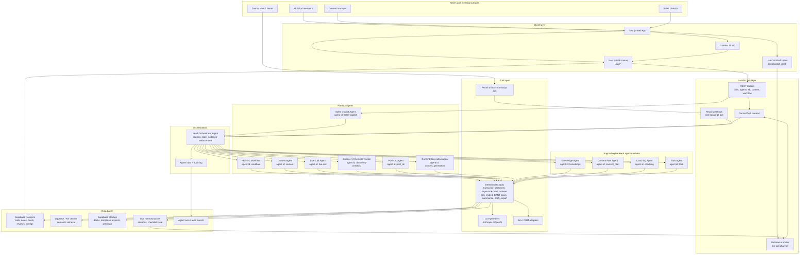
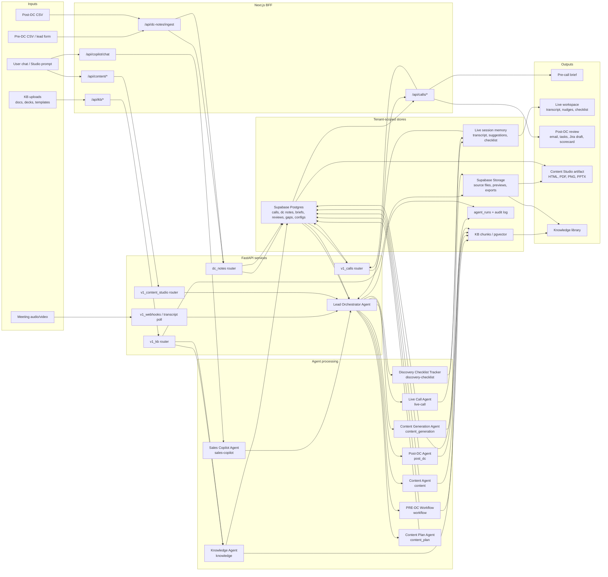

# Architecture: AI-Native Discovery Call Platform
**Companion to:** `01_PRD.md`
**Version:** 0.1 (Draft)
**Owner:** Ahmad
**Last updated:** May 2026

---

## 1. Architectural Position

Before diving into the diagram, three positions that shape every decision downstream:

### Position 1: Fewer agents, more tools

The transcript implied 10+ agents (sentiment, task, completeness, creative, content generation, knowledge base, etc). We reject that shape.

**Why:** Agent proliferation is the leading failure mode in production agentic systems. Each additional agent multiplies handoff failures, debugging surface area, latency, and cost. Most "agents" people imagine are actually **tools** — deterministic functions an LLM calls — not autonomous reasoning loops.

**Our shape:** One Lead Orchestrator Agent, six product agents exposed in the agent control surface, and a small set of supporting backend agent modules. Anything that does not require multi-step reasoning is a tool, not an agent.

### Position 2: Evidence before answers

Every agent output is structured as `{answer, citations[], confidence}`. The platform never renders an answer without a citation trail. This is enforced at the orchestration layer, not by hoping prompts behave.

### Position 3: Live and async are different systems

The live-call hot path has different requirements from async work (briefs, summaries, content generation). We isolate them. Live runs on streaming infra, low-latency models, aggressive caching. Async runs on batch infra, higher-quality models, more deliberate reasoning.

---

## 2. System Workflow Diagram

---

## 3. Agent Names in the Current System

The Agent Control Panel exposes the six product agents below. Backend modules also emit named agent envelopes for assistant dispatch, KB ingestion, content planning, and older coaching/task paths.

| Agent name | Agent id | Owns | Main trigger |
|---|---|---|---|
| **Lead Orchestrator Agent** | orchestrator | Routes events, enforces citations, logs runs, coordinates handoffs | REST/WebSocket/webhook events |
| **Sales Copilot Agent** | `sales-copilot` | Global assistant that answers user questions and dispatches agent actions | Bot-chat/copilot messages |
| **PRE-DC Workflow** | `workflow` | AI summary, artifact plan, KB fulfillment, content-gap sync | Pre-DC CSV ingest or manual workflow run |
| **Content Agent** | `content` | Pre-DC brief generation and relevant content retrieval fallback | Manual brief generation |
| **Live Call Agent** | `live-call` | Intent detection, live transcript analysis, proactive nudges, bot-chat answers | Recall transcript segment or live chat |
| **Discovery Checklist Tracker** | `discovery-checklist` | BANT/discovery coverage, timed nudges, final checklist handoff | Live transcript segment and call end |
| **Post-DC Agent** | `post_dc` | Post-call summary, email draft, task list, Jira draft, coaching scorecard | Call-end/post-call pipeline |
| **Content Generation Agent** | `content_generation` | Studio chat, template ingest, deck/one-pager generation, export | Content Studio project message or export |
| **Content Plan Agent** | `content_plan` | Turns a detected content gap into a concrete Studio generation plan | Content gap/suggestion planning |
| **Knowledge Agent** | `knowledge` | KB metadata ingest and chunk registration | KB asset metadata ingest |
| **Coaching Agent** | `coaching` | Coaching insight envelope used by older/supporting flows | Post-call coaching path |
| **Task Agent** | `task` | Email/task draft envelope used by older/supporting flows | Post-call task path |

Everything else - sentiment analysis, keyword extraction, BANT scoring, retrieval, embedding, export rendering, summarization, and citation validation - is a **tool**. Tools are deterministic, callable, cacheable, individually testable, and cheaper than another autonomous agent.

---

## 4. The Lead Orchestrator

The orchestrator is the only agent that holds state across the others. Its responsibilities:

1. **Routing:** decide which agent should handle an incoming event
2. **State management:** maintain call session state (pre/live/post, pod membership, KB version)
3. **Evidence enforcement:** reject any agent output that doesn't carry citations
4. **Cost gating:** check spend caps before dispatching expensive calls
5. **Handoff coordination:** when one agent's output becomes another's input, the orchestrator wires it (no agent-to-agent direct calls)
6. **Failure handling:** retries, fallbacks, model degradation paths

Critically, the orchestrator does **not** do reasoning about content. It does reasoning about *flow*. This separation keeps it simple, testable, and fast.

---

## 5. Data Flow Diagram

---

## 6. Data Flow: A Single DC End-to-End

### Pre-DC (T-4 hours before call)
1. Pre-DC CSV import, lead creation, or manual workflow run stores tenant-scoped lead fields in Supabase.
2. The Lead Orchestrator Agent dispatches **PRE-DC Workflow** (`workflow`).
3. PRE-DC Workflow creates the executive summary, plans needed artifacts, retrieves matching KB material, and marks missing content gaps.
4. **Content Agent** (`content`) can run the older/manual brief path when no imported Pre-DC row is available.
5. Orchestrator validates the agent envelope, writes the brief/relevant-content payload to Postgres, logs the run, and makes the brief available to the web app.

### Live Call (T-0)
1. Meeting bot joins via Recall.ai
2. Recall webhooks or transcript polling persist speaker-attributed transcript events.
3. Orchestrator sends each segment to **Live Call Agent** (`live-call`) for intent, sentiment, keyword, KB, and nudge decisions.
4. The same segment updates **Discovery Checklist Tracker** (`discovery-checklist`) for BANT coverage and discovery nudges.
5. WebSocket messages push transcript events, nudges, BANT signals, checklist updates, and bot-chat answers to the Live Call Workspace.
6. Live suggestions, transcript events, checklist state, and agent runs are stored for post-call replay.

### Post-DC (T+0 to T+60s)
1. Call-end event triggers Orchestrator
2. Orchestrator finalizes **Discovery Checklist Tracker** (`discovery-checklist`) from the full transcript and builds the Live Call Agent handoff.
3. **Post-DC Agent** (`post_dc`) turns transcript, live suggestions, Pre-DC fields, checklist coverage, and post-call records into review artifacts.
4. Output includes summary, email draft, next-step tasks, Jira draft data, deal signals, coaching scorecard, and approval-ready artifacts.
5. Orchestrator saves the review, syncs any post-call content gaps, optionally pre-generates a client landing page draft, and logs the run.

### Content and KB Loop
1. KB uploads go through the BFF and FastAPI KB router, then **Knowledge Agent** (`knowledge`) registers metadata/chunks for retrieval.
2. Content gaps can trigger **Content Plan Agent** (`content_plan`) to create a Studio-ready plan.
3. **Content Generation Agent** (`content_generation`) uses the plan, templates, KB evidence, and user prompts to produce artifacts.
4. Exports can be saved back into the KB, closing the loop for future Pre-DC, live-call, and post-call retrieval.

---

## 7. Key Build vs Buy Decisions

| Capability | Decision | Rationale |
|---|---|---|
| Meeting bot infra | **Buy** (Recall.ai) | Multi-platform support, consent handling, recording compliance — solved problem, not differentiating to build |
| Transcription | **Buy** (Recall.ai or AssemblyAI streaming) | Streaming ASR is a commodity; quality is good enough at sub-3s latency |
| Speaker diarization | **Buy** (comes with above) | Same reasoning |
| Vector DB | **Buy** (Pinecone or pgvector if scale stays modest) | pgvector if <10M chunks; Pinecone if scale demands it |
| LLM | **Buy** (Anthropic primary) | Claude is the best general-purpose model for grounded, citation-faithful outputs |
| Agent framework | **Build thin** | Off-the-shelf frameworks (LangGraph, AutoGen, CrewAI) are unstable abstractions for production; thin custom orchestrator is more maintainable |
| CRM integration | **Build adapter pattern** | Vendor SDKs are inconsistent; an adapter layer keeps the agent logic CRM-agnostic |
| Sentiment analysis | **Buy or model-based** | Either purpose-built sentiment API or just prompt Claude — tradeoff is latency vs nuance |
| Slide assembly | **Build** | No off-the-shelf solution handles "stitch from our deck library by intent" — this is differentiating |

---

## 8. Non-Functional Architecture

### Latency budgets (live call hot path)
- Audio → transcript display: 3s end-to-end
  - Bot capture → WS edge: 500ms
  - WS → Live Call Agent: 100ms
  - Transcribe tool: 1.5s
  - WS → client render: 200ms
  - Buffer: 700ms
- Bot-chat query → response: 5s
  - Includes 1 KB retrieval + 1 LLM call

### Cost guardrails
- Per-call ceiling: enforced at orchestrator. Hard stop at limit; user sees "cost cap reached" with admin override path
- Per-tenant monthly cap: surfaces in admin dashboard; warnings at 70/85/100%
- Model selection: tier of models exposed as policy. Coaching analysis uses higher-tier model; live keyword extract uses cheaper/faster tier
- Caching: every KB retrieval result cached on content hash; cuts retrieval cost ~60% in normal usage

### Observability
- Every LLM call wrapped: latency, prompt version, tokens, cost, model, agent, trace ID
- Every retrieval logged: query, top-K chunks returned, citation IDs surfaced
- Every agent decision logged with reasoning trace (sampled, not 100%, for cost reasons)
- Tracing tool: OpenTelemetry → time-series store; dashboards in Grafana or vendor equivalent

### Security
- Zero customer audio leaves region of capture (data residency by tenant)
- Recording consent captured before bot starts transcription; revocation drops the recording
- PII redaction tool runs on transcripts before they enter the KB (configurable; defaults to redact emails, phone numbers, credit card patterns)
- All agent prompts versioned; prompt injection detection on user-provided inputs (bot-chat queries)
- Audit log immutable, 12-month retention by default

---

## 9. Failure Modes and Degradation

The platform must degrade gracefully when components fail. Not all failures are equal.

| Failure | Detection | Degradation |
|---|---|---|
| LLM provider outage | Health check + request failure | Fallback to secondary provider; if all fail, queue async work, alert user for live work |
| Vector store down | Query failure | Live: serve from local cache (last known good). Async: retry with backoff |
| Meeting bot fails to join | Bot status callback | Notify AE; offer extension-based fallback or post-call upload |
| Cost cap hit | Pre-call cost check | Live: nudges throttle, transcript continues. Async: queue, alert admin |
| Citation missing on agent output | Orchestrator validation | Reject output; agent retries with stronger grounding prompt |
| Transcription quality poor | Confidence scoring | Flag low-confidence segments visibly; AE can mark for re-process |

---

## 10. Deployment Model

**Recommended v1:** Single-tenant per customer, regional deployment.

- Sales orgs have strong data isolation expectations
- Regional deployment satisfies GDPR / data residency
- Operationally heavier than multi-tenant but the right tradeoff for early customers

**Path to multi-tenant:** Yes, eventually. The data layer is designed with tenant_id everywhere from day one so the transition is mechanical, not architectural.

---

## 11. What's Deliberately Not in the Diagram

Things that will exist but aren't worth crowding the architecture view at this draft stage:

- Identity provider integration (SSO via OIDC; standard)
- Admin/back-office surfaces (user management, billing)
- Notification fan-out (email, Slack, in-app — standard webhook pattern)
- Backup, DR, restore (standard cloud-native patterns)
- CI/CD, infrastructure-as-code (standard, not differentiating)

These get their own design docs once the core architecture is locked.
