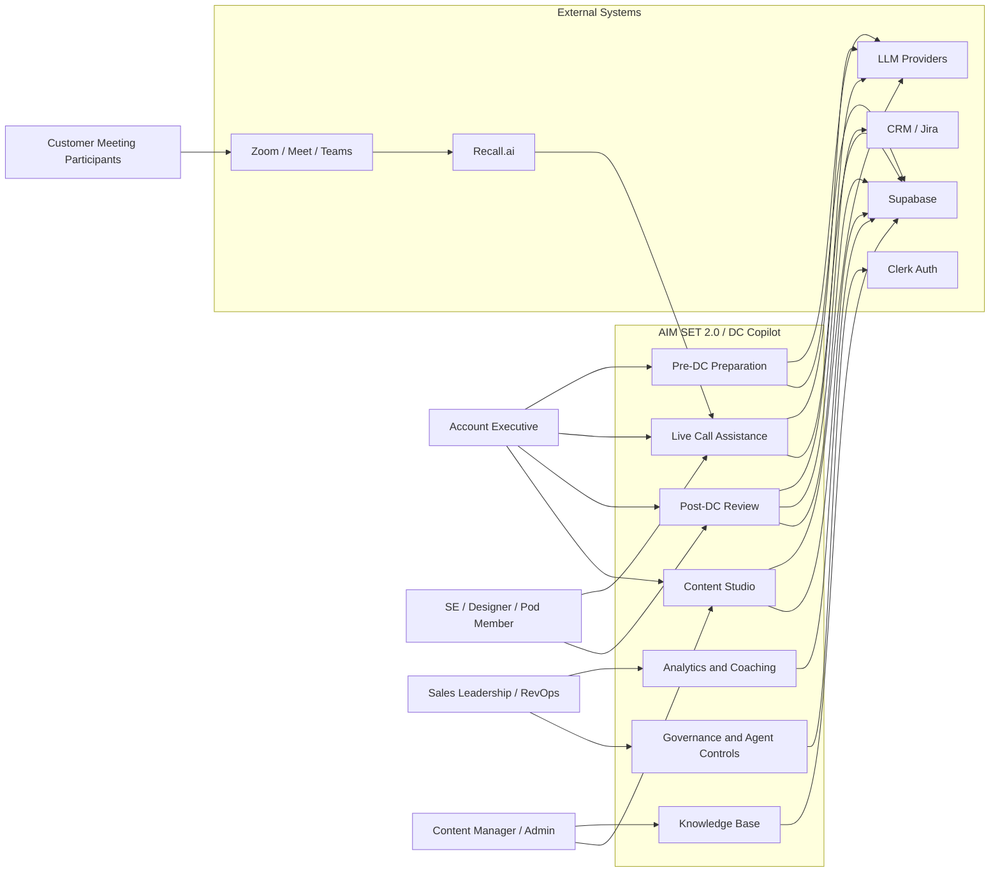
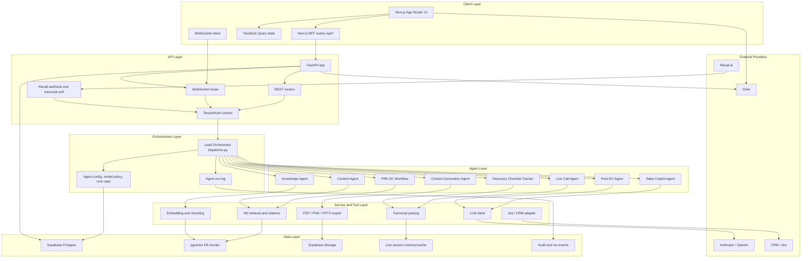
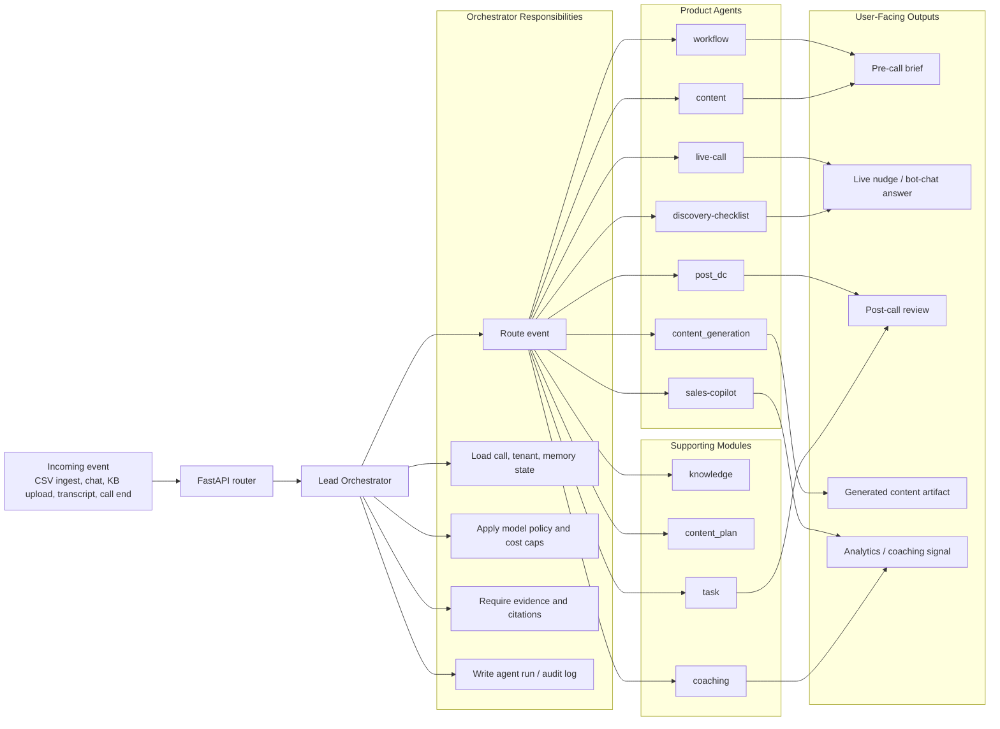
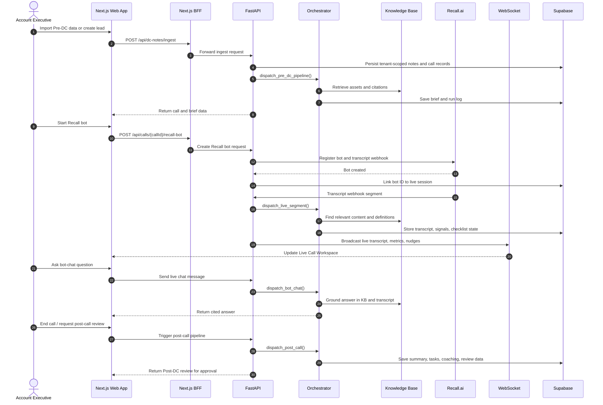
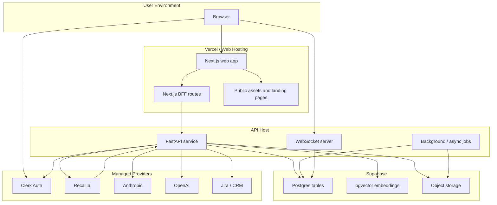

# SRS / Architecture Diagrams: AIM SET 2.0

This document is a combined Software Requirements Specification and Architecture diagram set for AIM SET 2.0 / DC Copilot. It maps user requirements to the implemented system layers and the main runtime flows.

## 1. SRS Context Diagram

## 2. Functional Requirements To Modules

```mermaid
flowchart TB
    REQ["SRS Functional Requirements"]

    REQ --> FR1["FR-1 Pre-DC preparation"]
    REQ --> FR2["FR-2 Live call assistance"]
    REQ --> FR3["FR-3 Post-DC artifacts"]
    REQ --> FR4["FR-4 Content generation"]
    REQ --> FR5["FR-5 Knowledge base"]
    REQ --> FR6["FR-6 Analytics and coaching"]
    REQ --> FR7["FR-7 Governance, audit, cost control"]

    subgraph UI["apps/web: Next.js UI + BFF"]
        HOME["Dashboard / Calls"]
        LIVEUI["Live Call Workspace"]
        POSTUI["Post-DC Review"]
        KBUi["Knowledge Library"]
        STUDIOUI["Content Studio"]
        AGENTUI["Agent Control Panel"]
    end

    subgraph API["services/api: FastAPI"]
        DCROUTER["dc_notes router"]
        CALLROUTER["v1_calls router"]
        WEBHOOKS["v1_webhooks router"]
        KBROUTER["v1_kb router"]
        CONTENTROUTER["v1_content_studio router"]
        AGENTROUTER["v1_agents router"]
        COPILOTROUTER["v1_copilot router"]
    end

    subgraph CORE["Backend domain and agents"]
        ORCH["Lead Orchestrator"]
        WORKFLOW["PRE-DC Workflow"]
        LIVEAGENT["Live Call Agent"]
        CHECKLIST["Discovery Checklist Tracker"]
        POSTAGENT["Post-DC Agent"]
        CONTENTAGENT["Content Agent"]
        GENAGENT["Content Generation Agent"]
        KNOWLEDGE["Knowledge Agent"]
    end

    FR1 --> HOME
    FR1 --> DCROUTER
    FR1 --> WORKFLOW

    FR2 --> LIVEUI
    FR2 --> CALLROUTER
    FR2 --> WEBHOOKS
    FR2 --> LIVEAGENT
    FR2 --> CHECKLIST

    FR3 --> POSTUI
    FR3 --> CALLROUTER
    FR3 --> POSTAGENT

    FR4 --> STUDIOUI
    FR4 --> CONTENTROUTER
    FR4 --> GENAGENT

    FR5 --> KBUi
    FR5 --> KBROUTER
    FR5 --> KNOWLEDGE
    FR5 --> CONTENTAGENT

    FR6 --> HOME
    FR6 --> AGENTROUTER
    FR6 --> ORCH

    FR7 --> AGENTUI
    FR7 --> AGENTROUTER
    FR7 --> ORCH

    DCROUTER --> ORCH
    CALLROUTER --> ORCH
    WEBHOOKS --> ORCH
    KBROUTER --> ORCH
    CONTENTROUTER --> ORCH
    COPILOTROUTER --> ORCH
    AGENTROUTER --> ORCH
```

## 3. Logical Architecture Diagram

## 4. Orchestrator And Agent Flow

## 5. End-To-End Runtime Sequence

## 6. Deployment / Runtime Architecture

## 7. Traceability Summary

| Requirement group | Primary UI surface | Backend entrypoint | Main orchestrator/agent owner | Data store |
|---|---|---|---|---|
| Pre-DC preparation | Dashboard, call brief | `dc_notes`, `v1_calls` | `dispatch_pre_dc_pipeline`, `workflow`, `content` | Supabase Postgres, KB vectors |
| Live call assistance | Live Call Workspace | `v1_calls`, `v1_webhooks`, WebSocket | `dispatch_live_segment`, `live-call`, `discovery-checklist` | Live memory, transcript events |
| Post-DC review | Post-DC review pages | `v1_calls` | `dispatch_post_call`, `post_dc` | Supabase Postgres |
| Knowledge base | Knowledge library | `v1_kb` | `dispatch_kb_ingest`, `knowledge` | Supabase Storage, pgvector |
| Content Studio | Content Studio | `v1_content_studio` | `dispatch_studio_turn`, `content_generation` | Studio tables, exports bucket |
| Copilot chat | Global copilot dock / bot chat | `v1_copilot` | `dispatch_copilot_chat`, `sales-copilot` | Run log, KB, call context |
| Governance | Agent Control Panel | `v1_agents` | Agent config defaults, model policy, run log | Agent config and audit tables |
