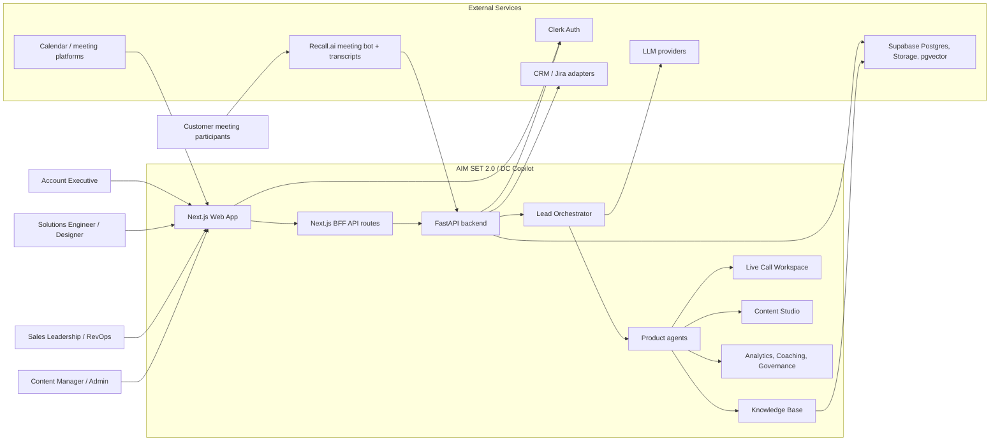
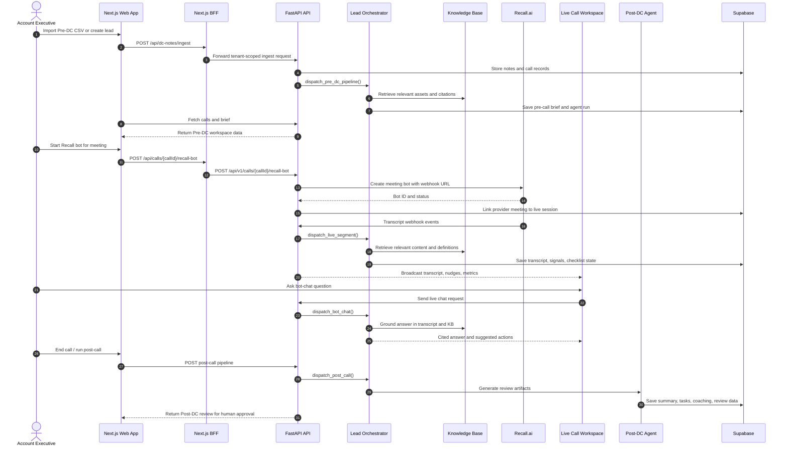
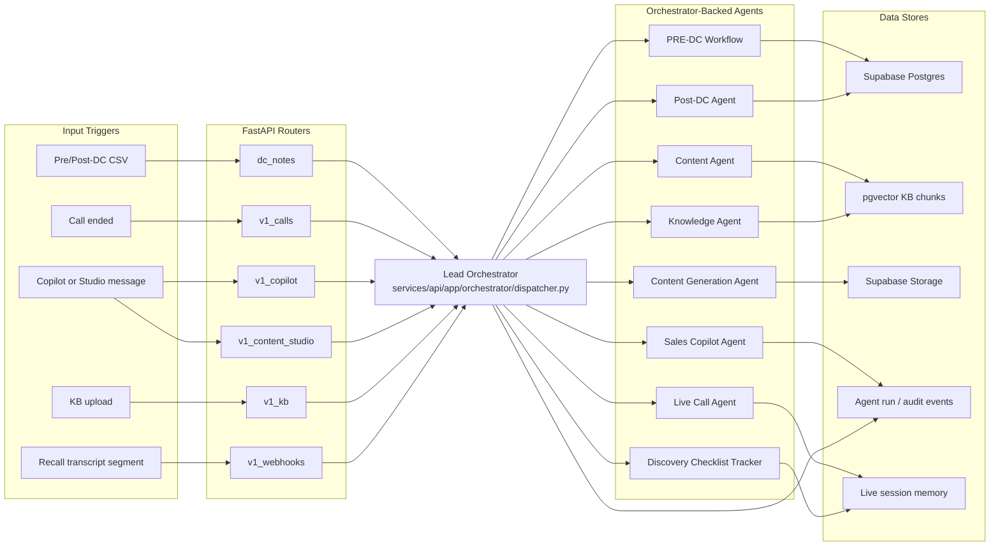

# SRS Diagrams: AIM SET 2.0 / DC Copilot

This document summarizes the Software Requirements Specification view of the project as diagrams. It focuses on what the system must support, who interacts with it, and how the main Discovery Call workflow moves through the product.

## 1. System Context

## 2. Functional Requirements Map

```mermaid
flowchart TB
    SRS["AIM SET 2.0 Functional Requirements"]

    SRS --> PRE["Pre-DC Preparation"]
    SRS --> LIVE["Live Call Assistance"]
    SRS --> POST["Post-DC Review"]
    SRS --> CONTENT["Content Generation"]
    SRS --> KB["Knowledge Base"]
    SRS --> LEADERSHIP["Analytics and Coaching"]
    SRS --> GOVERNANCE["Governance and Operations"]

    PRE --> PRE1["Import Pre-DC notes / lead data"]
    PRE --> PRE2["Create call records and briefs"]
    PRE --> PRE3["Generate AI summary, discovery questions, likely pains"]
    PRE --> PRE4["Recommend relevant KB assets and artifacts"]

    LIVE --> LIVE1["Start Recall bot for meeting"]
    LIVE --> LIVE2["Receive transcript segments via webhook or polling"]
    LIVE --> LIVE3["Detect intents, pains, keywords, sentiment"]
    LIVE --> LIVE4["Track BANT / discovery checklist coverage"]
    LIVE --> LIVE5["Show proactive nudges and grounded bot-chat answers"]

    POST --> POST1["Finalize live session at call end"]
    POST --> POST2["Generate post-call summary"]
    POST --> POST3["Draft follow-up email, CRM tasks, Jira ticket"]
    POST --> POST4["Create coaching and scorecard outputs"]
    POST --> POST5["Require human review before external action"]

    CONTENT --> CONTENT1["Detect content gaps"]
    CONTENT --> CONTENT2["Chat-driven Studio project creation"]
    CONTENT --> CONTENT3["Template ingest and scratch generation"]
    CONTENT --> CONTENT4["Export HTML, PDF, PNG, PPTX"]

    KB --> KB1["Upload documents, decks, templates, structured data"]
    KB --> KB2["Extract metadata and preview content"]
    KB --> KB3["Chunk and embed content for semantic retrieval"]
    KB --> KB4["Attach citations to AI outputs"]

    LEADERSHIP --> LEAD1["View calls, trends, content usage, coaching candidates"]
    LEADERSHIP --> LEAD2["Inspect agent activity and outcomes"]
    LEADERSHIP --> LEAD3["Review pipeline and discovery quality signals"]

    GOVERNANCE --> GOV1["Tenant-scoped auth and data isolation"]
    GOVERNANCE --> GOV2["Agent model policy and cost caps"]
    GOVERNANCE --> GOV3["Prompt versions and audit log"]
    GOVERNANCE --> GOV4["Runtime fallbacks and error handling"]
```

## 3. End-To-End Discovery Call Workflow

## 4. Agent and Data Flow

## 5. Non-Functional Requirements Coverage

```mermaid
flowchart TB
    NFR["Non-Functional Requirements"]

    NFR --> SECURITY["Security"]
    NFR --> PERFORMANCE["Performance"]
    NFR --> RELIABILITY["Reliability"]
    NFR --> AUDIT["Auditability"]
    NFR --> COST["Cost Governance"]
    NFR --> SCALE["Scalability"]

    SECURITY --> SEC1["Clerk auth and tenant context"]
    SECURITY --> SEC2["Tenant-scoped Supabase access"]
    SECURITY --> SEC3["Webhook secret validation for production Recall events"]

    PERFORMANCE --> PERF1["Live transcript path targets low latency"]
    PERFORMANCE --> PERF2["Cached KB retrieval and live memory"]
    PERFORMANCE --> PERF3["Async generation for heavier post-call and Studio work"]

    RELIABILITY --> REL1["Recall webhook plus transcript polling fallback"]
    RELIABILITY --> REL2["Agent fallback model policy"]
    RELIABILITY --> REL3["Graceful degraded responses for missing KB or LLM failures"]

    AUDIT --> AUD1["Agent run records"]
    AUDIT --> AUD2["Prompt version tracking"]
    AUDIT --> AUD3["Evidence and citation requirements"]

    COST --> COST1["Per-agent cost caps"]
    COST --> COST2["Model policy by agent"]
    COST --> COST3["Dashboard visibility for agent spend and runs"]

    SCALE --> SCALE1["Next.js BFF separates browser from backend"]
    SCALE --> SCALE2["FastAPI routes isolate workflow surfaces"]
    SCALE --> SCALE3["Supabase storage, Postgres, and pgvector for persistent data"]
```

